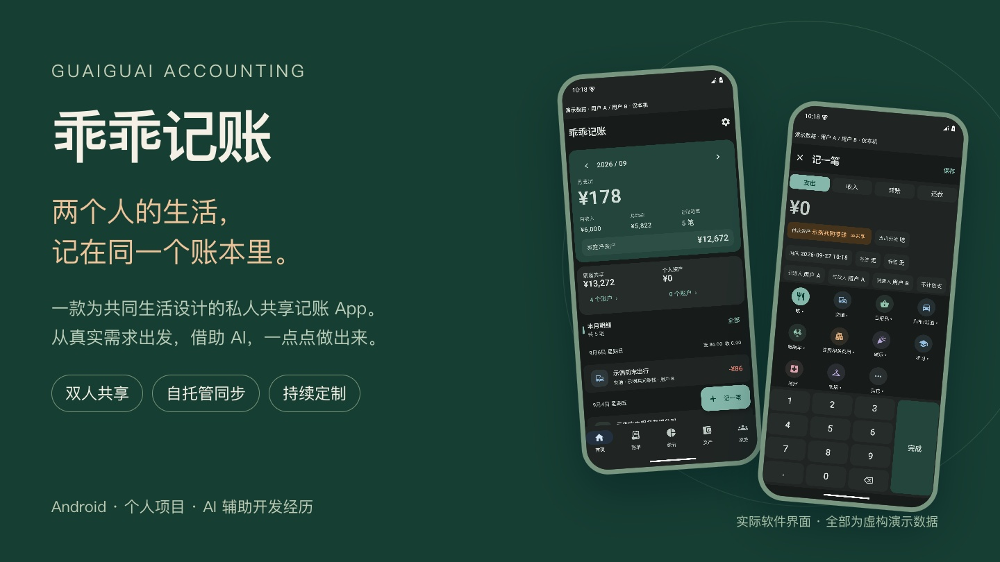
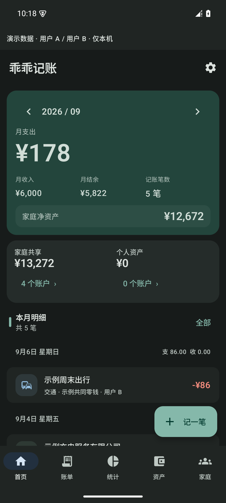
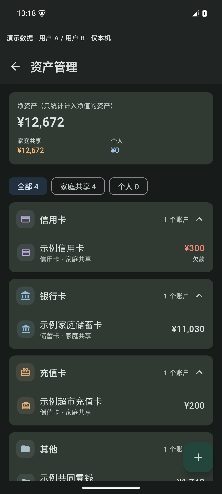
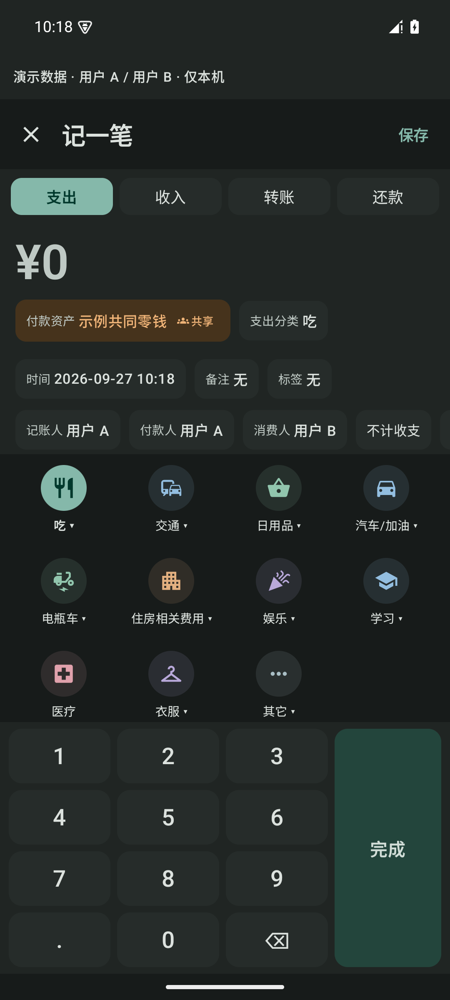
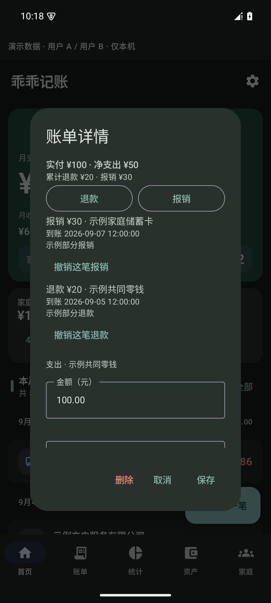
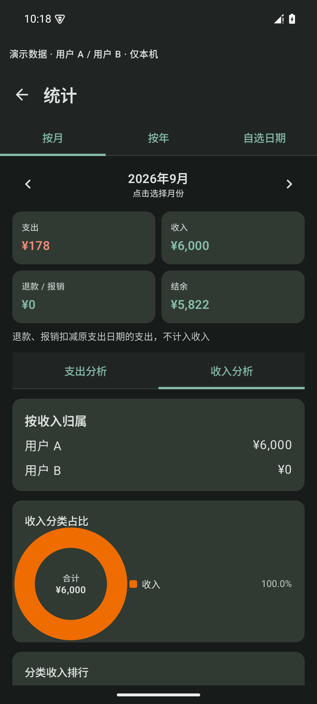
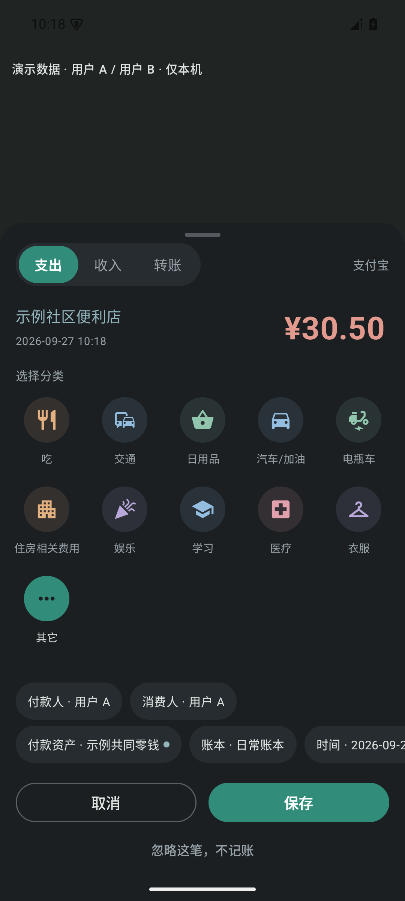
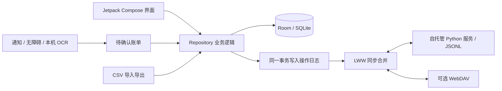

<div align="center">

# 乖乖记账 · GuaiGuai Accounting

**一款为两个人共同生活设计的私人共享记账 App**

Android · 双人共享 · 自托管 NAS · AI 辅助开发

[开发故事](docs/DEVELOPMENT_STORY.md) · [功能说明](docs/FEATURES.md) · [架构](docs/ARCHITECTURE.md) · [隐私](docs/PRIVACY.md) · [构建指南](docs/BUILDING.md)

</div>



## 为什么做这个项目

我从 2011 年读大学开始，就一直使用各种记账软件。记账这件事坚持下来了，但也有一些需求始终需要我去迁就软件。

一些专业产品的能力越来越丰富，对只想看清家庭日常收支的人来说，操作成本也随之增加。自动记账能省下不少录入，却很难完全理解每个人的消费习惯，结果仍然要花时间核对。两个人开始共同生活以后，一笔钱由谁记、谁付、花给谁，以及同一个家庭资金账户的余额如何变化，又变成了新的问题。

这些不是哪一款产品“做得不好”。通用商业软件需要服务很多人，不可能围绕一个家庭的特殊习惯持续修改。

AI 编程工具发展以后，我第一次有机会自己定义软件。乖乖记账从这个机会开始：我描述需要怎样记账，AI 协助实现，再拿到两台手机上，用真实生活检验这些想法。

## 主要功能

- **固定两个人共同维护**：人物与设备分开，记账人、付款人、消费人分别记录；消费人可选“家庭共同消费”。
- **共享同一份家庭资产**：两台设备的流水汇入同一个资产 ID，余额按流水和校准锚点计算；银行卡、信用卡、支付宝、微信、充值卡等分组查看。
- **收入、支出分别统计**：可切换月份、年份，或指定起止日期；支持人物、分类、资金账户维度。
- **退款和报销回到原账单**：在原支出内选择金额、到账账户和时间，支持分次记录；不算收入，回溯扣减原支出所属月份。
- **本地记账，自建同步**：Android 本地 Room 数据库，配套轻量 Python 服务；账本和确认后的回执附件可同步到自己的 NAS。WebDAV 为另一条可选通道。
- **自动记账持续优化**：通知与无障碍识别、完整确认窗口、重复提醒、商户分类学习；部分受限页面可选择本机 OCR 与截图附件。
- **日常操作尽量直接**：深色界面、细分图标、余额校准不混入日常账单，成功保存后退出表单。
- **独立 Demo 版本**：使用“用户 A / 用户 B”和虚构账目，显示演示标识，禁用同步与自动采集；与普通版本分开安装。

自动识别的覆盖范围和限制见 [FEATURES.md](docs/FEATURES.md)。它仍需使用者核对，不承诺所有银行、所有微信/支付宝版本或所有机型都能识别。

## 与普通个人记账软件的设计差异

| 设计问题 | 本项目的选择 |
|---|---|
| 面向谁 | 固定两个人共同生活的账本，不扩展成企业或多人财务系统 |
| 一笔支出属于谁 | 分开记录录入者、付款者、消费者 |
| 共享资产怎么记 | 两个人共同影响同一份余额，不维护两份互相覆盖的“余额副本” |
| 退款、报销算哪期 | 资金按实际到账变化，统计回溯扣减原支出月份 |
| 特殊商户怎么分类 | 可以学习修改结果，也保留本地配置的特定商户用途规则 |
| 数据放在哪里 | 先保存在自己的手机；可同步到自己管理的服务 |
| 谁决定功能 | 根据实际家庭使用反馈逐项调整 |

共享、退款、统计、自动识别等并非本项目独有。特点是这些能力围绕同一个家庭规则组合起来，而且可以继续按使用习惯修改。

## 软件截图

以下均为本项目实际 Compose 界面，使用隔离的虚构演示账本。未上传真实支付截图、历史账目或设备通知。

| 首页 | 共享资产 | 记账角色 |
|---|---|---|
|  |  |  |

| 退款与报销 | 收入统计 | 自动记账确认 |
|---|---|---|
|  |  |  |

图片来源、演示数值和检查方法见 [截图说明](docs/images/README.md)。

## 技术架构



客户端为 Kotlin + Jetpack Compose / Material 3，使用 Room、Coroutines / Flow、WorkManager、OkHttp、kotlinx.serialization 和 Google ML Kit 文本识别。服务端使用 Python 标准库 `ThreadingHTTPServer`，配有 Docker、鉴权、备份和升级脚本。数据库 schema 当前为 v3。

项目没有云端 AI 记账接口；AI 在这里主要参与开发。OCR 处理路径在手机本地执行。完整数据流、冲突规则与边界见 [ARCHITECTURE.md](docs/ARCHITECTURE.md)。

## 快速运行

准备 JDK 17、Android SDK 35，并通过 Android Studio 或 `ANDROID_HOME` 配置 SDK 路径：

```bash
./gradlew testDebugUnitTest lintDebug assembleDebug assembleDemo
python3 -m unittest discover -s server -p 'test_*.py'
```

- 普通开发版：`app/build/outputs/apk/debug/`，application ID 为 `dev.guaiguai.accounting.dev`。
- Demo 版：`app/build/outputs/apk/demo/`，application ID 为 `dev.guaiguai.accounting.demo`。
- 公共构建不依赖任何私人服务器、同步令牌或正式签名文件。
- 自托管配置、演示模式及设备验收步骤见 [BUILDING.md](docs/BUILDING.md)。

## 数据和隐私

数据自主掌控意味着部署和备份也由使用者负责。公共版本默认离线，NAS 地址和凭据需要自行配置。仓库只提供 `.env.example` 与 `config.local.properties.example`，真实值留在被 Git 忽略的本地文件中。

当前并未实现端到端加密，也未使用加密版 Room 或系统密钥库保护所有本地偏好。手机、NAS 管理员和备份持有者可能读取数据。启用无障碍、通知读取和截图识别前，应理解它们能接触的支付页面信息。详情见 [PRIVACY.md](docs/PRIVACY.md)。

[发布前审查](SECURITY_REVIEW.md) 与 [发布检查清单](GITHUB_RELEASE_CHECKLIST.md) 公开记录检查范围、处理方式和已知限制，绝不包含秘密原文。

## AI 开发

这不是一个由专业程序员从零规划的产品。我没有正规编程背景，连计算机二级也没有通过。最初使用 DeepSeek Harness 尝试，后来转向 Codex + GPT-6 Astra。在这一次个人项目中，后者让“提出需求—实现—测试—修正”的循环更容易推进。

我负责定义需求、判断交互是否顺手、反馈手机上的问题；AI 协助代码、测试、排查和文档。提高效率的同时，也需要反复校验生成内容，尤其是余额、同步、重复入账和隐私。

- [一个不会编程的人，是怎样借助 AI 做出自己的记账软件的](docs/DEVELOPMENT_STORY.md)
- [AI 参与方式、实测时间和用量口径](docs/AI_DEVELOPMENT.md)

## 当前状态与 Roadmap

这是正在使用、持续迭代的个人项目，公开整理基于私人版 0.3.6。它不是成熟商业产品，也没有应用商店级兼容性或安全认证。公开工程与原私人安装隔离，不提供已有私人数据库的自动迁移。

近期重点是自动识别可靠性、截图生命周期、同步安全和可配置性。预算、日历、周期账单和通用 Excel 导入标记为 **Planning / WIP**，不当作已经完成的功能展示。见 [Roadmap](docs/ROADMAP.md) 与 [CHANGELOG](CHANGELOG.md)。

## License

作者目前选择**仅准备公开展示，暂不授予开源许可证**。仓库可见不代表已按 MIT、GPL 或其他开源许可证授权。第三方依赖仍遵循各自许可证；本项目授权状态见 [LICENSE.md](LICENSE.md) 和 [第三方说明](docs/THIRD_PARTY.md)。
